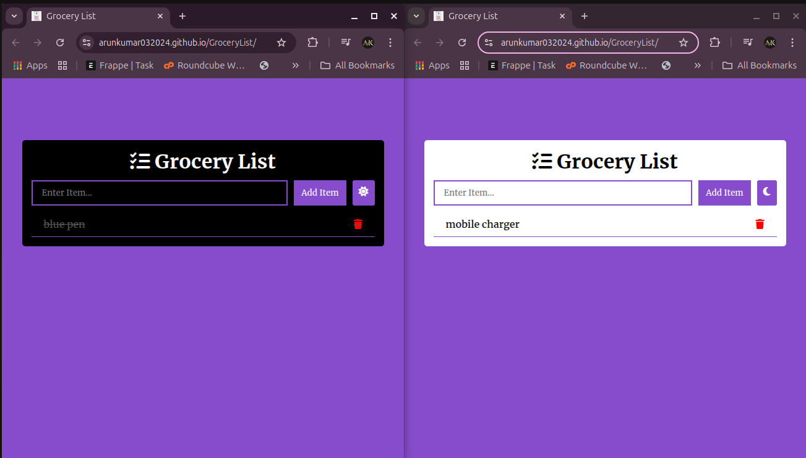

# Grocery List Web App

An easy-to-use web application that helps you manage your grocery items efficiently. Built with pure HTML, CSS, and JavaScript, this project showcases basic CRUD operations and dark mode functionality.

## Features

- **Add Items**: Easily add items to your grocery list.
- **Delete Items**: Remove items when they're no longer needed.
- **Dark Mode Toggle**: Switch between light and dark modes for a better user experience.
- **Persistent Data**: (Optional for future enhancements) Save the list in local storage for persistent access.

## Tech Stack

- **HTML**: Structure of the application.
- **CSS**: Custom styling with light and dark mode designs.
- **JavaScript**: Enables dynamic interactions, such as adding and deleting items.

## Project Screenshots



## How to Use

1. Open the application in your browser:  
   👉 [Grocery List Demo](https://arunkumar032024.github.io/GroceryList/)
   
2. Add items to the grocery list by typing in the input box and clicking **Add Item**.

3. To delete an item, click on the red trash can icon next to it.

4. Use the dark mode toggle to switch themes.

## How to Run Locally

1. Clone the repository:
   ```bash
   git clone https://github.com/your-username/GroceryList.git
